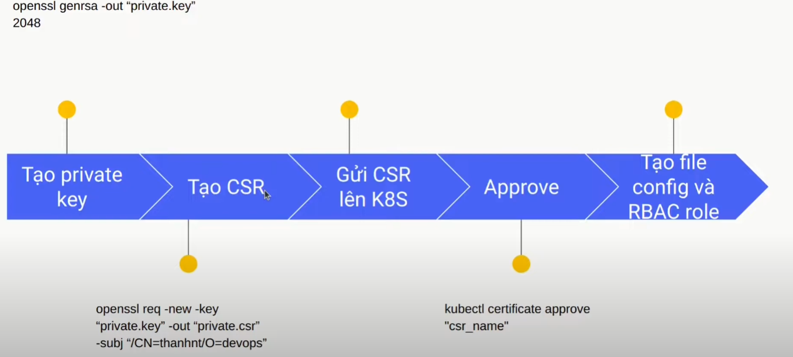

# Phân quyền trong Kubernetes
- Các bước phân quyền như sau: 

### 1. create private key: 
 
> openssl genrsa -out "private.key" 2048

### 2. create csr: 

> openssl req -new -key "private.key" -out "private.csr" -subj /CN=taonc/O=dev 

### 3. Gửi csr vừa tạo nên kubernetes:

~~~
cat <<EOF | kubectl create -f -
apiVersion: certificates.k8s.io/v1
kind: CertificateSigningRequest
metadata:
  name: taonc
spec:
  groups:
  - system:authenticated
  request: $(cat "private.csr" | base64 | tr -d '\n')
  signerName: kubernetes.io/kube-apiserver-client
  expirationSeconds: 86400
  usages:
  - client auth
EOF
~~~
> request: $(cat "private.csr" | base64 | tr -d '\n') : mục đích của dòng này là xóa đi các ký tự và khoảng trắng giữa các dòng trong file csr

### 4. Kiểm tra và trình ký
- kiểm tra csr lúc này crs sẽ chưa được approve nên trạng thái của nó sẽ là **PENDING**:
 
 > kubectl get csr

- xem crs dưới dạng yaml. {spec.request} được hiểu như là lá đơn trình lên kubernetes để kubernetes ký cho chúng ta:
 > kubectl get csr taonc -o yaml

~~~
apiVersion: certificates.k8s.io/v1
kind: CertificateSigningRequest
metadata:
  annotations:
    kubectl.kubernetes.io/last-applied-configuration: |
      {"apiVersion":"certificates.k8s.io/v1","kind":"CertificateSigningRequest","metadata":{"annotations":{},"name":"taonc"},"spec":{"groups":["system:authenticated"],"request":"LS0tLS1CRUdJTiBDRVJUSUZJQ0FURSBSRVFVRVNULS0tLS0KTUlJQ1l6Q
0NBVXNDQVFBd0hqRU9NQXdHQTFVRUF3d0ZkR0Z2Ym1NeEREQUtCZ05WQkFvTUEyUmxkakNDQVNJdwpEUVlKS29aSWh2Y05BUUVCQlFBRGdnRVBBRENDQVFvQ2dnRUJBTlczYWNNeXNwYU90QTBISEh1RFF4Ymg5OEhSCjl0TmZEek85czc1VXNWaEJsYkdpUHFXWkJ2QVR3aHpuQkFVZ0hnZW9Wa3E5aUt3S21sT0Ev
cWNDMFgyVHBOYzcKdDdXUS9FUWloYzhZSm5OZGxlL2tqUENzK3RzSnpWb21EUWNWSUNjWWZqZ21UbzFUVTcrSGp3U3ZPZ3htMWtCOApCWDlUMkI3eHlvQkZ2bFJia1JOMEp6NUxSRmZ2WCtBaDlKZjZUT0R5NWpGNVJON2lTY1kzdit6QUViYjB1QnlFCldqVWRpSjMvV2JOKzVGM1phblpPWnJEa1F5RU5EYmNqUUZ
COXFNaWJRK1NYRHY0U1ZUbGVQSEJQK3J6aWs2UkIKcmJmM3BBcjBhSkVNc3ZWNkw4TTVrUjNtTGxzT0NCNUVTWFZhMGNDM2VkQWdMU3hWVXBUQlYrVzZOYVVDQXdFQQpBYUFBTUEwR0NTcUdTSWIzRFFFQkN3VUFBNElCQVFBZVlWU25RMi9IOTBQWEVGRFRCTGdxY0o0czdQZlNZYWJnClc4RjhoSlpRclU5cW5ibj
Q2NkorNjdlQ1BURFc0SWNSaGV2Rko3Y2NoWS8xRFlkU3ViU0U0Nzc0UHFTSzRPQXAKWWIzVVJyaCsxRFBnK1RFZmNZYmIwUUFmbnFQb2pPc1k1Q2RZMzhIZWJOa3FSbGdFbVk5cHNOUHA4TlorOTZvNgpRejltWkhsbVY1VzV5YjRkanBVWjF2WnAzTVRseUZsdVlJVVZEZDZIVVJ6VGVNNW9kYXVLVFZzaXY5V3Qyd
HNECkR0aHBNcHRwdG9vY3JqMFB4MlMzQ0pNY04yR24yTjh0YUpaQjkya1lrSExBVElNb0c2b0VtOGk0WDlLb3YxRlYKdXZhbXhYSUJPcjVZU1RDV253cUJMWlJXK1hzUVQ5RXV0UktERUtOcmJDUDRncUZvTTE5SgotLS0tLUVORCBDRVJUSUZJQ0FURSBSRVFVRVNULS0tLS0K","signerName":"kubernetes.i
o/kube-apiserver-client","usages":["client auth"]}}
  creationTimestamp: "2024-02-01T16:09:29Z"
  name: taonc
  resourceVersion: "355778"
  uid: 4e7b7ec4-2f17-42fa-b2e9-059eaae72fab
spec:
  groups:
  - system:masters
  - system:authenticated
  request: LS0tLS1CRUdJTiBDRVJUSUZJQ0FURSBSRVFVRVNULS0tLS0KTUlJQ1l6Q0NBVXNDQVFBd0hqRU9NQXdHQTFVRUF3d0ZkR0Z2Ym1NeEREQUtCZ05WQkFvTUEyUmxkakNDQVNJdwpEUVlKS29aSWh2Y05BUUVCQlFBRGdnRVBBRENDQVFvQ2dnRUJBTlczYWNNeXNwYU90QTBISEh1RFF4Ymg5OEhSCjl0
TmZEek85czc1VXNWaEJsYkdpUHFXWkJ2QVR3aHpuQkFVZ0hnZW9Wa3E5aUt3S21sT0EvcWNDMFgyVHBOYzcKdDdXUS9FUWloYzhZSm5OZGxlL2tqUENzK3RzSnpWb21EUWNWSUNjWWZqZ21UbzFUVTcrSGp3U3ZPZ3htMWtCOApCWDlUMkI3eHlvQkZ2bFJia1JOMEp6NUxSRmZ2WCtBaDlKZjZUT0R5NWpGNVJON2l
TY1kzdit6QUViYjB1QnlFCldqVWRpSjMvV2JOKzVGM1phblpPWnJEa1F5RU5EYmNqUUZCOXFNaWJRK1NYRHY0U1ZUbGVQSEJQK3J6aWs2UkIKcmJmM3BBcjBhSkVNc3ZWNkw4TTVrUjNtTGxzT0NCNUVTWFZhMGNDM2VkQWdMU3hWVXBUQlYrVzZOYVVDQXdFQQpBYUFBTUEwR0NTcUdTSWIzRFFFQkN3VUFBNElCQV
FBZVlWU25RMi9IOTBQWEVGRFRCTGdxY0o0czdQZlNZYWJnClc4RjhoSlpRclU5cW5ibjQ2NkorNjdlQ1BURFc0SWNSaGV2Rko3Y2NoWS8xRFlkU3ViU0U0Nzc0UHFTSzRPQXAKWWIzVVJyaCsxRFBnK1RFZmNZYmIwUUFmbnFQb2pPc1k1Q2RZMzhIZWJOa3FSbGdFbVk5cHNOUHA4TlorOTZvNgpRejltWkhsbVY1V
zV5YjRkanBVWjF2WnAzTVRseUZsdVlJVVZEZDZIVVJ6VGVNNW9kYXVLVFZzaXY5V3QydHNECkR0aHBNcHRwdG9vY3JqMFB4MlMzQ0pNY04yR24yTjh0YUpaQjkya1lrSExBVElNb0c2b0VtOGk0WDlLb3YxRlYKdXZhbXhYSUJPcjVZU1RDV253cUJMWlJXK1hzUVQ5RXV0UktERUtOcmJDUDRncUZvTTE5SgotLS0t
LUVORCBDRVJUSUZJQ0FURSBSRVFVRVNULS0tLS0K
  signerName: kubernetes.io/kube-apiserver-client
  usages:
  - client auth
  username: kubernetes-admin
~~~

- Approve certificate: 

> kubectl certificate approve taonc

- Sau khi approve csr file csr thêm trường {.status.certificate}. Có thể hiểu {.status.certificate} chính là lá đơn mà ta gửi lên đã được kubernetes chấp nhận (đã ký cho rồi)
~~~
apiVersion: certificates.k8s.io/v1
kind: CertificateSigningRequest
metadata:
  annotations:
    kubectl.kubernetes.io/last-applied-configuration: |
      {"apiVersion":"certificates.k8s.io/v1","kind":"CertificateSigningRequest","metadata":{"annotations":{},"name":"taonc"},"spec":{"groups":["system:authenticated"],"request":"LS0tLS1CRUdJTiBDRVJUSUZJQ0FURSBSRVFVRVNULS0tLS0KTUlJQ1l6Q
0NBVXNDQVFBd0hqRU9NQXdHQTFVRUF3d0ZkR0Z2Ym1NeEREQUtCZ05WQkFvTUEyUmxkakNDQVNJdwpEUVlKS29aSWh2Y05BUUVCQlFBRGdnRVBBRENDQVFvQ2dnRUJBTlczYWNNeXNwYU90QTBISEh1RFF4Ymg5OEhSCjl0TmZEek85czc1VXNWaEJsYkdpUHFXWkJ2QVR3aHpuQkFVZ0hnZW9Wa3E5aUt3S21sT0Ev
cWNDMFgyVHBOYzcKdDdXUS9FUWloYzhZSm5OZGxlL2tqUENzK3RzSnpWb21EUWNWSUNjWWZqZ21UbzFUVTcrSGp3U3ZPZ3htMWtCOApCWDlUMkI3eHlvQkZ2bFJia1JOMEp6NUxSRmZ2WCtBaDlKZjZUT0R5NWpGNVJON2lTY1kzdit6QUViYjB1QnlFCldqVWRpSjMvV2JOKzVGM1phblpPWnJEa1F5RU5EYmNqUUZ
COXFNaWJRK1NYRHY0U1ZUbGVQSEJQK3J6aWs2UkIKcmJmM3BBcjBhSkVNc3ZWNkw4TTVrUjNtTGxzT0NCNUVTWFZhMGNDM2VkQWdMU3hWVXBUQlYrVzZOYVVDQXdFQQpBYUFBTUEwR0NTcUdTSWIzRFFFQkN3VUFBNElCQVFBZVlWU25RMi9IOTBQWEVGRFRCTGdxY0o0czdQZlNZYWJnClc4RjhoSlpRclU5cW5ibj
Q2NkorNjdlQ1BURFc0SWNSaGV2Rko3Y2NoWS8xRFlkU3ViU0U0Nzc0UHFTSzRPQXAKWWIzVVJyaCsxRFBnK1RFZmNZYmIwUUFmbnFQb2pPc1k1Q2RZMzhIZWJOa3FSbGdFbVk5cHNOUHA4TlorOTZvNgpRejltWkhsbVY1VzV5YjRkanBVWjF2WnAzTVRseUZsdVlJVVZEZDZIVVJ6VGVNNW9kYXVLVFZzaXY5V3Qyd
HNECkR0aHBNcHRwdG9vY3JqMFB4MlMzQ0pNY04yR24yTjh0YUpaQjkya1lrSExBVElNb0c2b0VtOGk0WDlLb3YxRlYKdXZhbXhYSUJPcjVZU1RDV253cUJMWlJXK1hzUVQ5RXV0UktERUtOcmJDUDRncUZvTTE5SgotLS0tLUVORCBDRVJUSUZJQ0FURSBSRVFVRVNULS0tLS0K","signerName":"kubernetes.i
o/kube-apiserver-client","usages":["client auth"]}}
  creationTimestamp: "2024-02-01T16:09:29Z"
  name: taonc
  resourceVersion: "355778"
  uid: 4e7b7ec4-2f17-42fa-b2e9-059eaae72fab
spec:
  groups:
  - system:masters
  - system:authenticated
  request: LS0tLS1CRUdJTiBDRVJUSUZJQ0FURSBSRVFVRVNULS0tLS0KTUlJQ1l6Q0NBVXNDQVFBd0hqRU9NQXdHQTFVRUF3d0ZkR0Z2Ym1NeEREQUtCZ05WQkFvTUEyUmxkakNDQVNJdwpEUVlKS29aSWh2Y05BUUVCQlFBRGdnRVBBRENDQVFvQ2dnRUJBTlczYWNNeXNwYU90QTBISEh1RFF4Ymg5OEhSCjl0
TmZEek85czc1VXNWaEJsYkdpUHFXWkJ2QVR3aHpuQkFVZ0hnZW9Wa3E5aUt3S21sT0EvcWNDMFgyVHBOYzcKdDdXUS9FUWloYzhZSm5OZGxlL2tqUENzK3RzSnpWb21EUWNWSUNjWWZqZ21UbzFUVTcrSGp3U3ZPZ3htMWtCOApCWDlUMkI3eHlvQkZ2bFJia1JOMEp6NUxSRmZ2WCtBaDlKZjZUT0R5NWpGNVJON2l
TY1kzdit6QUViYjB1QnlFCldqVWRpSjMvV2JOKzVGM1phblpPWnJEa1F5RU5EYmNqUUZCOXFNaWJRK1NYRHY0U1ZUbGVQSEJQK3J6aWs2UkIKcmJmM3BBcjBhSkVNc3ZWNkw4TTVrUjNtTGxzT0NCNUVTWFZhMGNDM2VkQWdMU3hWVXBUQlYrVzZOYVVDQXdFQQpBYUFBTUEwR0NTcUdTSWIzRFFFQkN3VUFBNElCQV
FBZVlWU25RMi9IOTBQWEVGRFRCTGdxY0o0czdQZlNZYWJnClc4RjhoSlpRclU5cW5ibjQ2NkorNjdlQ1BURFc0SWNSaGV2Rko3Y2NoWS8xRFlkU3ViU0U0Nzc0UHFTSzRPQXAKWWIzVVJyaCsxRFBnK1RFZmNZYmIwUUFmbnFQb2pPc1k1Q2RZMzhIZWJOa3FSbGdFbVk5cHNOUHA4TlorOTZvNgpRejltWkhsbVY1V
zV5YjRkanBVWjF2WnAzTVRseUZsdVlJVVZEZDZIVVJ6VGVNNW9kYXVLVFZzaXY5V3QydHNECkR0aHBNcHRwdG9vY3JqMFB4MlMzQ0pNY04yR24yTjh0YUpaQjkya1lrSExBVElNb0c2b0VtOGk0WDlLb3YxRlYKdXZhbXhYSUJPcjVZU1RDV253cUJMWlJXK1hzUVQ5RXV0UktERUtOcmJDUDRncUZvTTE5SgotLS0t
LUVORCBDRVJUSUZJQ0FURSBSRVFVRVNULS0tLS0K
  signerName: kubernetes.io/kube-apiserver-client
  usages:
  - client auth
  username: kubernetes-admin
status:
  certificate: LS0tLS1CRUdJTiBDRVJUSUZJQ0FURS0tLS0tCk1JSURCRENDQWV5Z0F3SUJBZ0lSQU9TUTc0REZlVmFjeU8waTgvSlhRRVF3RFFZSktvWklodmNOQVFFTEJRQXcKRlRFVE1CRUdBMVVFQXhNS2EzVmlaWEp1WlhSbGN6QWVGdzB5TkRBeU1ERXhOakEyTURsYUZ3MHlOVEF4TXpFeApOakEyTURs
YU1CNHhEREFLQmdOVkJBb1RBMlJsZGpFT01Bd0dBMVVFQXhNRmRHRnZibU13Z2dFaU1BMEdDU3FHClNJYjNEUUVCQVFVQUE0SUJEd0F3Z2dFS0FvSUJBUURWdDJuRE1yS1dqclFOQnh4N2cwTVc0ZmZCMGZiVFh3OHoKdmJPK1ZMRllRWld4b2o2bG1RYndFOEljNXdRRklCNEhxRlpLdllpc0NwcFRnUDZuQXRGOWs
2VFhPN2Uxa1B4RQpJb1hQR0NaelhaWHY1SXp3clByYkNjMWFKZzBIRlNBbkdINDRKazZOVTFPL2g0OEVyem9NWnRaQWZBVi9VOWdlCjhjcUFSYjVVVzVFVGRDYytTMFJYNzEvZ0lmU1gra3pnOHVZeGVVVGU0a25HTjcvc3dCRzI5TGdjaEZvMUhZaWQKLzFtemZ1UmQyV3AyVG1hdzVFTWhEUTIzSTBCUWZhakltMF
BrbHc3K0VsVTVYanh3VC9xODRwT2tRYTIzOTZRSwo5R2lSRExMMWVpL0RPWkVkNWk1YkRnZ2VSRWwxV3RIQXQzblFJQzBzVlZLVXdWZmx1aldsQWdNQkFBR2pSakJFCk1CTUdBMVVkSlFRTU1Bb0dDQ3NHQVFVRkJ3TUNNQXdHQTFVZEV3RUIvd1FDTUFBd0h3WURWUjBqQkJnd0ZvQVUKeThMUlpIMkErbG50Q2JqU
klXdE5vR1ZVWjlJd0RRWUpLb1pJaHZjTkFRRUxCUUFEZ2dFQkFJU0dvb3NFWG5MYgpJa2p5NlpaSnZtL2ZqaFBtL0tSQ0pud3VRUzVhTElhUmFnMTRqdjdjeHMwSEVqK1ZYUE9INWk0enhPSlJaZi9kCnRTNFJoMExCT0Q3WFdoMVZKMHBwNE81eWIvamZNeXkzNXpwdDkvb250a000OGxuQjl5L2dUOXpkczZtaGlK
WksKQlZha3VGREY4UG1BT0NaN2hFY2ZVOHZyVXV6YUVhR2ZybjNNYVZtL0grSm52MUlYM0RNUTZkSkJSWUN6ZFBFZwpnKzJTMldrL0dIVnJyaS9GRUF6TEUvK3UrVkk0TW9ybUtHeG42R1htNkFwSDhuYnRqYW1MT2lvbGo2R09RaXNFCmJvWnhqTFZjUXl0eXJJZlZxN09qcXREeGk4TDFiclBZMkJtVDZMRXNkN3Y
4NTQ2Q0s1MmsvUlRMaS8vcnJoYlUKaXVTUmgrdzZSYjA9Ci0tLS0tRU5EIENFUlRJRklDQVRFLS0tLS0K
  conditions:
  - lastTransitionTime: "2024-02-01T16:11:09Z"
    lastUpdateTime: "2024-02-01T16:11:09Z"
    message: This CSR was approved by kubectl certificate approve.
    reason: KubectlApprove
    status: "True"
    type: Approved
~~~

- Lấy lá đơn trình ký và lấy cái khóa bí mật của người ký(private key):
  - Cách một sử dụng thư viện: 

    > kubernetes get csr taonc -o yaml | yq e '.stattus.certificate'

  - Cách hai là copy phần ta cần ra một file nào đó ở đây sẽ lưu ra một file tên **myuser.crt**

    > kubectl get csr taonc -o jsonpath='{.status.certificate}'| base64 -d > myuser.crt
~~~
.stattus.certificate:
LS0tLS1CRUdJTiBDRVJUSUZJQ0FURS0tLS0tCk1JSURCRENDQWV5Z0F3SUJBZ0lSQU9TUTc0REZlVmFjeU8waTgvSlhRRVF3RFFZSktvWklodmNOQVFFTEJRQXcKRlRFVE1CRUdBMVVFQXhNS2EzVmlaWEp1WlhSbGN6QWVGdzB5TkRBeU1ERXhOakEyTURsYUZ3MHlOVEF4TXpFeApOakEyTURs
YU1CNHhEREFLQmdOVkJBb1RBMlJsZGpFT01Bd0dBMVVFQXhNRmRHRnZibU13Z2dFaU1BMEdDU3FHClNJYjNEUUVCQVFVQUE0SUJEd0F3Z2dFS0FvSUJBUURWdDJuRE1yS1dqclFOQnh4N2cwTVc0ZmZCMGZiVFh3OHoKdmJPK1ZMRllRWld4b2o2bG1RYndFOEljNXdRRklCNEhxRlpLdllpc0NwcFRnUDZuQXRGOWs
2VFhPN2Uxa1B4RQpJb1hQR0NaelhaWHY1SXp3clByYkNjMWFKZzBIRlNBbkdINDRKazZOVTFPL2g0OEVyem9NWnRaQWZBVi9VOWdlCjhjcUFSYjVVVzVFVGRDYytTMFJYNzEvZ0lmU1gra3pnOHVZeGVVVGU0a25HTjcvc3dCRzI5TGdjaEZvMUhZaWQKLzFtemZ1UmQyV3AyVG1hdzVFTWhEUTIzSTBCUWZhakltMF
BrbHc3K0VsVTVYanh3VC9xODRwT2tRYTIzOTZRSwo5R2lSRExMMWVpL0RPWkVkNWk1YkRnZ2VSRWwxV3RIQXQzblFJQzBzVlZLVXdWZmx1aldsQWdNQkFBR2pSakJFCk1CTUdBMVVkSlFRTU1Bb0dDQ3NHQVFVRkJ3TUNNQXdHQTFVZEV3RUIvd1FDTUFBd0h3WURWUjBqQkJnd0ZvQVUKeThMUlpIMkErbG50Q2JqU
klXdE5vR1ZVWjlJd0RRWUpLb1pJaHZjTkFRRUxCUUFEZ2dFQkFJU0dvb3NFWG5MYgpJa2p5NlpaSnZtL2ZqaFBtL0tSQ0pud3VRUzVhTElhUmFnMTRqdjdjeHMwSEVqK1ZYUE9INWk0enhPSlJaZi9kCnRTNFJoMExCT0Q3WFdoMVZKMHBwNE81eWIvamZNeXkzNXpwdDkvb250a000OGxuQjl5L2dUOXpkczZtaGlK
WksKQlZha3VGREY4UG1BT0NaN2hFY2ZVOHZyVXV6YUVhR2ZybjNNYVZtL0grSm52MUlYM0RNUTZkSkJSWUN6ZFBFZwpnKzJTMldrL0dIVnJyaS9GRUF6TEUvK3UrVkk0TW9ybUtHeG42R1htNkFwSDhuYnRqYW1MT2lvbGo2R09RaXNFCmJvWnhqTFZjUXl0eXJJZlZxN09qcXREeGk4TDFiclBZMkJtVDZMRXNkN3Y
4NTQ2Q0s1MmsvUlRMaS8vcnJoYlUKaXVTUmgrdzZSYjA9Ci0tLS0tRU5EIENFUlRJRklDQVRFLS0tLS0K
~~~

  - Lấy private key mà ta tạo ở bước đầu tiên:
  > cat "private.csr" | base64 | tr -d '\n'

~~~
private key:
LS0tLS1CRUdJTiBDRVJUSUZJQ0FURSBSRVFVRVNULS0tLS0KTUlJQ1l6Q0NBVXNDQVFBd0hqRU9NQXdHQTFVRUF3d0ZkR0Z2Ym1NeEREQUtCZ05WQkFvTUEyUmxkakNDQVNJdwpEUVlKS29aSWh2Y05BUUVCQlFBRGdnRVBBRENDQVFvQ2dnRUJBTlczYWNNeXNwYU90QTBISEh1RFF4Ymg5OEhSCjl0TmZEek85czc
1VXNWaEJsYkdpUHFXWkJ2QVR3aHpuQkFVZ0hnZW9Wa3E5aUt3S21sT0EvcWNDMFgyVHBOYzcKdDdXUS9FUWloYzhZSm5OZGxlL2tqUENzK3RzSnpWb21EUWNWSUNjWWZqZ21UbzFUVTcrSGp3U3ZPZ3htMWtCOApCWDlUMkI3eHlvQkZ2bFJia1JOMEp6NUxSRmZ2WCtBaDlKZjZUT0R5NWpGNVJON2lTY1kzdit6QU
ViYjB1QnlFCldqVWRpSjMvV2JOKzVGM1phblpPWnJEa1F5RU5EYmNqUUZCOXFNaWJRK1NYRHY0U1ZUbGVQSEJQK3J6aWs2UkIKcmJmM3BBcjBhSkVNc3ZWNkw4TTVrUjNtTGxzT0NCNUVTWFZhMGNDM2VkQWdMU3hWVXBUQlYrVzZOYVVDQXdFQQpBYUFBTUEwR0NTcUdTSWIzRFFFQkN3VUFBNElCQVFBZVlWU25RM
i9IOTBQWEVGRFRCTGdxY0o0czdQZlNZYWJnClc4RjhoSlpRclU5cW5ibjQ2NkorNjdlQ1BURFc0SWNSaGV2Rko3Y2NoWS8xRFlkU3ViU0U0Nzc0UHFTSzRPQXAKWWIzVVJyaCsxRFBnK1RFZmNZYmIwUUFmbnFQb2pPc1k1Q2RZMzhIZWJOa3FSbGdFbVk5cHNOUHA4TlorOTZvNgpRejltWkhsbVY1VzV5YjRkanBV
WjF2WnAzTVRseUZsdVlJVVZEZDZIVVJ6VGVNNW9kYXVLVFZzaXY5V3QydHNECkR0aHBNcHRwdG9vY3JqMFB4MlMzQ0pNY04yR24yTjh0YUpaQjkya1lrSExBVElNb0c2b0VtOGk0WDlLb3YxRlYKdXZhbXhYSUJPcjVZU1RDV253cUJMWlJXK1hzUVQ5RXV0UktERUtOcmJDUDRncUZvTTE5SgotLS0tLUVORCBDRVJ
USUZJQ0FURSBSRVFVRVNULS0tLS0K
~~~

### 5. Tạo ra file config mới
- Chủ yếu sửa phần user đặc biết là hai phần dưới đây chính là lá đơn đã được ký và khóa bí mật của ta:
  - {users.user.client-certificate-data}
  - {users.user.client-key-data}

~~~
#!bin/bash
cat <<EOF > config
apiVersion: v1
clusters:
- cluster:
    certificate-authority-data: LS0tLS1CRUdJTiBDRVJUSUZJQ0FURS0tLS0tCk1JSUMvakNDQWVhZ0F3SUJBZ0lCQURBTkJna3Foa2lHOXcwQkFRc0ZBREFWTVJNd0VRWURWUVFERXdwcmRXSmwKY201bGRHVnpNQjRYRFRJME1ERXhOekUyTVRnek9Gb1hEVE0wTURFeE5ERTJNVGd6T0Zvd0ZURVRNQkVHQTFVRQpBeE1LYTNWaVpYSnVaWFJsY3pDQ0FTSXdEUVlKS29aSWh2Y05BUUVCQlFBRGdnRVBBRENDQVFvQ2dnRUJBTXhxCmdVbytXSkxWY29BWlkzR3E0N0tWaUtDUkVMRUtwZE44TW5KN1NobFhLWkZ3ZHJUZmQ1Y29PZVpSSk91TG4yQUMKTWNIaUtEYUtKSWROWFZjNU9ZdFZMYzhURHdvTUFNTk1Fai9LVTJScDNuR3dieHFId2lkVy9NdFJQQkNkUkZ1UgpRRmNodmdJUG1xRkhyMFdnQ2dieExtK1psOXlFZTk2S2lRNjJUY0xBZDc5c0o4bFVDaE9aenZqVkdkQnI3SmhwCklwcGQ1V29nMzlSWmRxYkJGVkpYckx0czFwY212ckJnRFZpU2VOTHFFd3c3QWd3YVhRbUhnMy91d3cwajVndG8KWGZwTWFZbWxFOWxGdnh3Q2RENjM3TE51OTlSTnR4dlM2VVR6WWRpOUIwbGtLcVZDWjh2anRIall4bm1UcXlqeQpUeHRRMS9NVm51MjhNSkJidm1rQ0F3RUFBYU5aTUZjd0RnWURWUjBQQVFIL0JBUURBZ0trTUE4R0ExVWRFd0VCCi93UUZNQU1CQWY4d0hRWURWUjBPQkJZRUZGY241V0hPc1FGVkxqdDhFelFRU2ZOU1l5UFBNQlVHQTFVZEVRUU8KTUF5Q0NtdDFZbVZ5Ym1WMFpYTXdEUVlKS29aSWh2Y05BUUVMQlFBRGdnRUJBQmFkc2NYZE4rQTZmM2pyYXVObwpRa281WHdOMnIweFJ0RWpZQzJSVS85dmpFbGcvaFBkNy9KeXE2TnFBWVBNSWNHN09oM0pXRmtlSkg3Qk55ZUl3CjZWZnRZTzJWMGF6dDZvVWpEYm5GWFVPYWdsLzFQaVUyNVV1NFZuTXlGUjhIZUl5cGdkSXQ5R3lPQ3VmQjV6K3MKalAxaE84UEdWYmVjMFIxMlFLeEFOSFRENmQxVXdpQnJmWHBhaElHTjZSdVBObFB1QUpwOXFTVzIwVzdaazBhUwp3RzBNOEVjeWx5RktzTEFPZkl2VVRMeWtJVjNxd1dxMHppRFRlaUoxYXEwckVwMlZGU00yVFU2WnhlQ0p6Z3pWCmpHZkkrTnJFQ3VsOXFlQ0lodUdSNFRiZDZFOTUyUmlhbHdEN3p5TXpFY2lKaEJFU3h4aXhnR3JIT1lITWlPVWgKTFRRPQotLS0tLUVORCBDRVJUSUZJQ0FURS0tLS0tCg==
    server: https://127.0.0.1:6443
  name: cluster.local
contexts:
- context:
    cluster: cluster.local
    user: taonc
  name: kubernetes-admin@cluster.local
current-context: kubernetes-admin@cluster.local
kind: Config
preferences: {}
users:
- name: taonc
  user:
    client-certificate-data: $(cat "myuser.crt" | base64 | tr -d '\n')
    client-key-data: $(cat "private.key" | base64 | tr -d '\n')
EOF
~~~

*Giờ ta đã có file config mới*
- Thử dùng file config mới xem sao:

  > export KUBECONFIG=config

  > kubectl get nodes

* Sẽ báo lỗi user "taonc" cannot list resource "nodes" in API.... Ta phải cấp quyền cho user

### 6. Cấp quyền cho user bằng RBAC
- Nếu muốn phân quyền cho 1 namespace thì dùng role và RoleBinding

~~~
apiVersion: rbac.authorization.k8s.io/v1
kind: Role
metadata:
  namespace: monitoring
  name: monitoring
rules:
- apiGroups: [""] # "" indicates the core API group
  resources: ["*"] # "secrect,pods,deployment"
  verbs: ["get", "watch", "list"]
---
apiVersion: rbac.authorization.k8s.io/v1
# This role binding allows "jane" to read pods in the "default" namespace.
# You need to already have a Role named "pod-reader" in that namespace.
kind: RoleBinding
metadata:
  name: monitoring
  namespace: monitoring
subjects:
# You can specify more than one "subject"
- kind: User
  name: taonc # "name" is case sensitive
  apiGroup: rbac.authorization.k8s.io
roleRef:
  # "roleRef" specifies the binding to a Role / ClusterRole
  kind: Role #this must be Role or ClusterRole
  name: monitoring # this must match the name of the Role or ClusterRole you wish to bind to
  apiGroup: rbac.authorization.k8s.io
~~~

> Chỉ được ["get", "watch", "list"] trong namespace **monitoring**
- Nếu muốn phân quyền toàn cluster dùng ClusterRole và ClusterRoleBinding 

~~~
apiVersion: rbac.authorization.k8s.io/v1
kind: ClusterRole
metadata:
  name: Readonly
rules:
- apiGroups: [""] # "" indicates the core API group
  resources: ["*"] # "secrect,pods,deployment"
  verbs: ["get", "watch", "list"]
---
apiVersion: rbac.authorization.k8s.io/v1
# This role binding allows "jane" to read pods in the "default" namespace.
# You need to already have a Role named "pod-reader" in that namespace.
kind: ClusterRoleBinding 
metadata:
  name: Readonly-binding
subjects:
# You can specify more than one "subject"
- kind: User
  name: taonc # "name" is case sensitive
  apiGroup: rbac.authorization.k8s.io
roleRef:
  # "roleRef" specifies the binding to a Role / ClusterRole
  kind: Role #this must be Role or ClusterRole
  name: Readonly # this must match the name of the Role or ClusterRole you wish to bind to
  apiGroup: rbac.authorization.k8s.io
~~~

