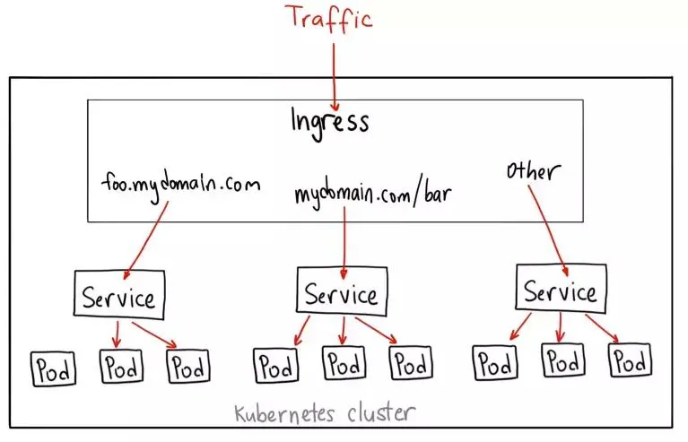
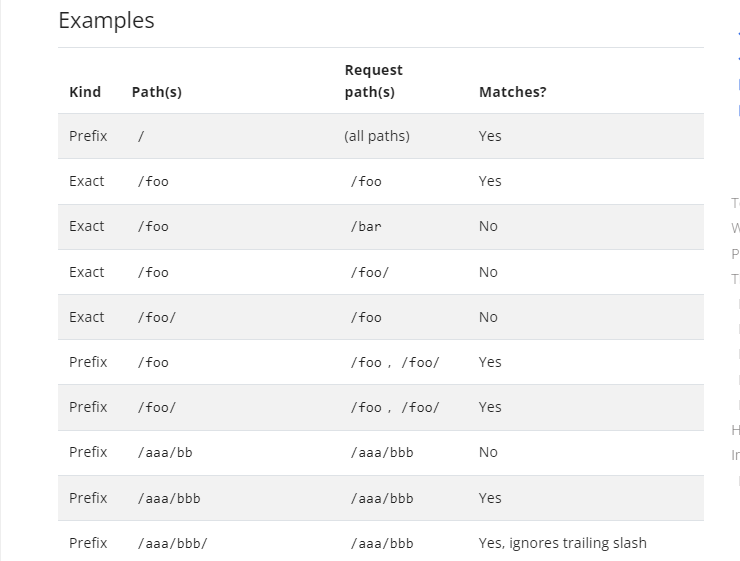
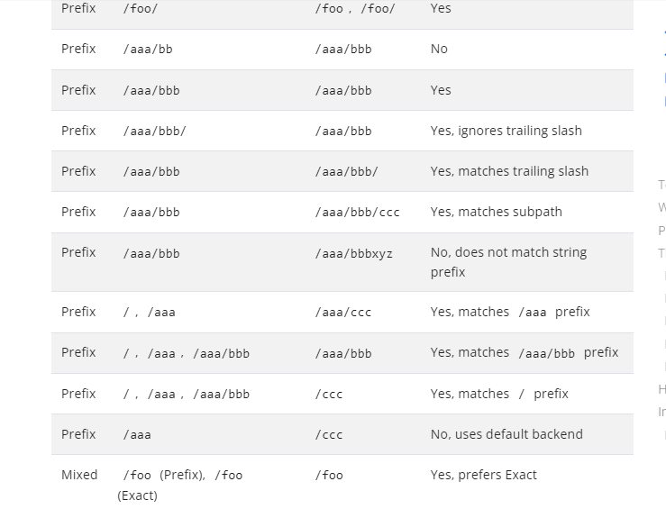
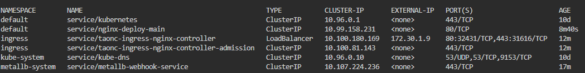
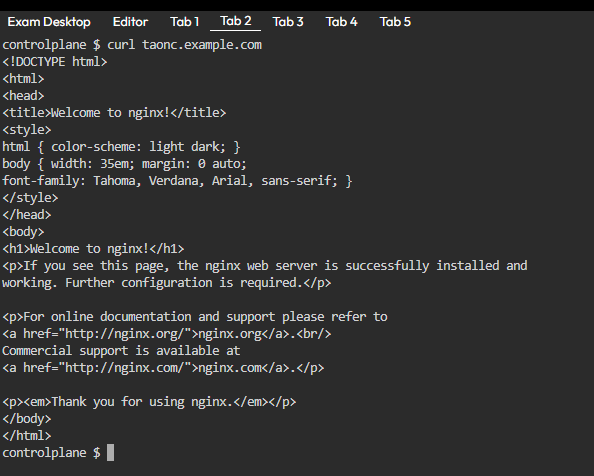
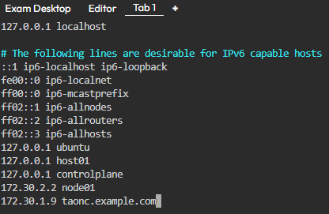
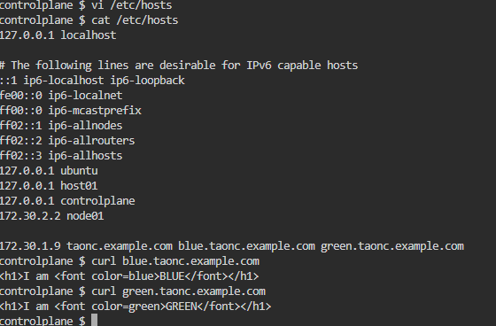

# INGRESS IN KUBERNETES

## 1. Ingress là gì?. Tại sao lại cần phải sử dụng ingress?
- chúng ta đã biết 4 loại service type và cách sử dụng chúng. Trong đó để expose ứng dụng ra bên ngoài thì chỉ có NodePort và LoadBalancer (trên onprem thì 2 loại này coi như 1).
#### Sử dụng NodePort có một số hạn chế:
- ervice được expose hoàn toàn ra bên ngoài
Phải sử dụng qua port NodePort (thay vì sử dụng port http/https cho các ứng dụng web thì phải thêm cái đuôi NodePort vào sau domainname --> Nhìn nó kém chuyên nghiệp thật sự 😄)
Số lượng Port sử dụng cho NodePort hạn chế (mặc định range NodePort từ 30000-32767)
#### Kubernetes Ingress sẽ giúp giải quyết vấn đề nêu trên:

- Các service ứng dụng sẽ được expose dưới dạng ClusterIP và sau đó được expose ra bên ngoài qua Ingress --> Service thực sự trong suốt với người dùng. Người dùng chỉ thực sự kết nối tới Ingress Controller
Có thể dùng thêm external LoadBalancer bên ngoài để trỏ tới IngressController --> Có thể sử dụng port http/https để kết nối tới domain tương ứng của service thay vì phải chỉ định thêm NodePort, nhìn nó chuyên nghiệp hơn hẳn
Không bị hạn chế bởi số lượng Port mà NodePort có thể cung cấp.
## 2. Cơ chế hoạt động của Kubernetes Ingress.

#### Cơ chế hoạt động của Ingress gồm 2 thành phần chính:

- Ingress Controller: Là thành phần điều khiển chính làm nhiệm vụ điều hướng các request tới các service bên trong k8s. Thường thì Ingress Controller được cài đặt trên K8S và được expose ra ngoài dưới dạng NodePort.

- Ingress Rule: Là một tài nguyên trên K8S. Nó chứa nội dung khai báo rule để điều hướng từ một request tới một service cụ thể trên trong K8S.

- **NOTE**: Có nhiều Ingress Controller từ các nhà phát triển khác bạn có thể lựa chọn để cài đặt. Ngoài ra trên k8s cũng hỗ trợ cài đặt nhiều Ingress Controller tùy nhu cầu sử dụng. Trong bài này sẽ chỉ đề cập đến Nginx ingress.

    

## 3. Ingress

### Phân loại
- Ingress là một tài nguyên ở mức Namespace trên K8S. Và giống như các tài nguyên khác như Pod, Deployment hay Service, ta có thể định nghĩa nó bằng cách sử dụng file manifest dạng yaml. Có một số cách định tuyến: Định tuyến dựa trên URL, Định tuyến dựa trên host,Định tuyến bảo mật TLS

#### Đây là định tuyến theo host:

```
apiVersion: networking.k8s.io/v1
kind: Ingress
metadata:
  name: ingress-resource-1
spec:
  ingressClassName: nginx
  rules:
  - host: taonc.example.com
    http:
      paths:
      - path: /
        pathType: Prefix
        backend:
          service:
            name: nginx-deploy-main
            port: 
              number: 80
```

Cấu hình Ingress để định tuyến lưu lượng truy cập từ domain "taonc.example.com" đến Service "nginx-deploy-main" trong namespace default. 

#### Đây là định tuyến theo URL:

```
apiVersion: networking.k8s.io/v1
kind: Ingress
metadata:
  name: minimal-ingress
  annotations:
    nginx.ingress.kubernetes.io/rewrite-target: /
spec:
  ingressClassName: nginx-example
  rules:
  - http:
      paths:
      - path: /testpath
        pathType: Prefix
        backend:
          service:
            name: test
            port:
              number: 80
```
Ý nghĩa của khai báo trên là mọi request tới mà có Path chứa Prefix là /testpath thì sẽ được forward tới servcie test ở port 80.

#### Định tuyến bảo mật TLS:
Nếu  cần đảm bảo tính riêng tư và bảo mật cho lưu lượng truy cập vào dịch vụ , có thể sử dụng Ingress để cấu hình định tuyến bảo mật TLS. Dưới đây là một ví dụ về cách cấu hình Ingress để định tuyến lưu lượng truy cập bảo mật từ domain "foo.bar.com" đến Service "service1" trong namespace default và sử dụng chứng chỉ TLS:

```
apiVersion: networking.k8s.io/v1
kind: Ingress
metadata:
  name: example-ingress
  annotations:
    nginx.ingress.kubernetes.io/ssl-redirect: "true"
    cert-manager.io/issuer: "letsencrypt-prod"
spec:
  tls:
    - hosts:
        - foo.bar.com
      secretName: example-tls
  rules:
    - host: foo.bar.com
      http:
        paths:
          - path: /
            pathType: ImplementationSpecific
            backend:
              service:
                name: service1
                port:
                  number: 80
```

- Ở trên là 3 phương pháp sử dụng ingress khác nhau, tuy vậy chúng đều có một phần chung là **rules**. Ta sẽ tìm hiểu về chúng.

### Ingress Rules
##### Path Type
- Prefix
- Exact
- ImplementationSpecific

Giải thích hết bọn này khá khó hiểu thay vào đó ta xem một số cách sử dụng của chúng được cung cấp bởi kubernetes: 



## 4. Example
Trong ví dụ này ta sẽ đề sử dụng load balancer nhưng vì không có tiền nên sử dụng metallb để thay thế
#### Triển khai metallb
```
kubectl apply -f https://raw.githubusercontent.com/metallb/metallb/v0.14.5/config/manifests/metallb-native.yaml
```
Xét rải IP cho loab balancer. Dãi ip phải cùng rải của node và dải ip phải là ip chưa được sử dụng

```
apiVersion: metallb.io/v1beta1
kind: IPAddressPool
metadata:
  name: first-pool
  namespace: metallb-system
spec:
  addresses:
  - 172.30.1.9-172.30.1.10
---
apiVersion: metallb.io/v1beta1
kind: L2Advertisement
metadata:
  name: example
  namespace: metallb-system
```
- Sau khi triển khai metallb xong thì ta sẽ có một địa chỉ load balancer (**172.30.1.9**)

### Triển khai demo
- Nginx ingress thì  dùng helm triển khai nên ta đi trực tiếp vào ví dụ:

```
apiVersion: apps/v1
kind: Deployment
metadata:
  labels:
    run: nginx
  name: nginx-deploy-main
spec:
  replicas: 1
  selector:
    matchLabels:
      run: nginx-main
  template:
    metadata:
      labels:
        run: nginx-main
    spec:
      containers:
      - image: nginx
        name: nginx
---
apiVersion: v1
kind: Service
metadata:
  creationTimestamp: "2024-06-18T15:52:50Z"
  labels:
    run: nginx
  name: nginx-deploy-main
  namespace: default
spec:
  ports:
  - port: 80
    protocol: TCP
    targetPort: 80
  selector:
    run: nginx-main
  sessionAffinity: None
  type: ClusterIP
status:
  loadBalancer: {}
```
```
apiVersion: networking.k8s.io/v1
kind: Ingress
metadata:
  name: ingress-resource-1
spec:
  ingressClassName: nginx
  rules:
  - host: taonc.example.com
    http:
      paths:
      - path: /
        pathType: Prefix
        backend:
          service:
            name: nginx-deploy-main
            port: 
              number: 80
```
- Ta có một deployment và một service tương ứng. 
- Triển khai thêm một ingress. Ingress sẽ foward từ LB của metallb(**172.30.1.9**) đến service **nginx-deploy-main** . Lúc này **taonc.example.com** đóng vai trò là **172.30.1.9**. Nếu là nền tảng cloud thì không cần phải config host nhưng đây là on-prime nên ta phải set hosts.


- curl thử nhá.



>> Giờ tất cả dữ liệu trỏ vào **taonc.example.com**  sẽ được ingress foward đến service **nginx-deploy-main**

- Xóa ingress đầu tiên nhá:
```
k delete ing ingress-resource-1
```
- Triển khai thêm hai deploy **Blue** và **Green** :
```
apiVersion: apps/v1
kind: Deployment
metadata:
  labels:
    run: nginx
  name: nginx-deploy-blue
spec:
  replicas: 1
  selector:
    matchLabels:
      run: nginx-blue
  template:
    metadata:
      labels:
        run: nginx-blue
    spec:
      volumes:
      - name: webdata
        emptyDir: {}
      initContainers:
      - name: web-content
        image: busybox
        volumeMounts:
        - name: webdata
          mountPath: "/webdata"
        command: ["/bin/sh", "-c", 'echo "<h1>I am <font color=blue>BLUE</font></h1>" > /webdata/index.html']
      containers:
      - image: nginx
        name: nginx
        volumeMounts:
        - name: webdata
          mountPath: "/usr/share/nginx/html"

```

```
apiVersion: apps/v1
kind: Deployment
metadata:
  labels:
    run: nginx
  name: nginx-deploy-green
spec:
  replicas: 1
  selector:
    matchLabels:
      run: nginx-green
  template:
    metadata:
      labels:
        run: nginx-green
    spec:
      volumes:
      - name: webdata
        emptyDir: {}
      initContainers:
      - name: web-content
        image: busybox
        volumeMounts:
        - name: webdata
          mountPath: "/webdata"
        command: ["/bin/sh", "-c", 'echo "<h1>I am <font color=green>GREEN</font></h1>" > /webdata/index.html']
      containers:
      - image: nginx
        name: nginx
        volumeMounts:
        - name: webdata
          mountPath: "/usr/share/nginx/html"

```
- Apply new ingress

```
apiVersion: networking.k8s.io/v1
kind: Ingress
metadata:
  name: ingress-resource-2
spec:
  ingressClassName: nginx
  rules:
  - host: taonc.example.com
    http:
      paths:
      - path: /
        pathType: Prefix
        backend:
          service:
            name: nginx-deploy-main
            port:
              number: 80
  - host: blue.taonc.example.com
    http:
      paths:
      - path: /
        pathType: Prefix
        backend:
          service:
            name: nginx-deploy-blue
            port:
              number: 80
  - host: green.taonc.example.com
    http:
      paths:
      - path: /
        pathType: Prefix
        backend:
          service:
            name: nginx-deploy-green
            port:
              number: 80

```
- Kiểm tra mới biết là lỗi.


- Quên chưa expose service của hai thằng deployment ở trên
```
k expose deploy nginx-deploy-blue --port 80
```
```
k expose deploy nginx-deploy-green --port 80
```
- check lại.



- Set lại /etc/hosts và curl thử thôi.



> để tránh trường hợp là bao nhiêu host lại phải thêm vào ví dụ có yellow, black thì không cần phải xét host một cách cực đoan như vậy.

- Ta xử dụng annotation mới của ingress nginx: **nginx.ingress.kubernetes.io/rewrite-target: /**

```
apiVersion: networking.k8s.io/v1
kind: Ingress
metadata:
  annotations:
    nginx.ingress.kubernetes.io/rewrite-target: /
  name: ingress-resource-3
spec:
  ingressClassName: nginx
  rules:
  - host: taonc.example.com
    http:
      paths:
      - path: /
        pathType: Prefix
        backend:
          service:
            name: nginx-deploy-main
            port:
              number: 80
      - path: /blue
        pathType: Prefix
        backend:
          service:
            name: nginx-deploy-blue
            port:
              number: 80
      - path: /green
        pathType: Prefix
        backend:
          service:
            name: nginx-deploy-green
            port:
              number: 80

```
- Lúc này file hosts của chúng ta sẽ như sau.

- Để truy cập vào blue thì: **taonc.example.blue**