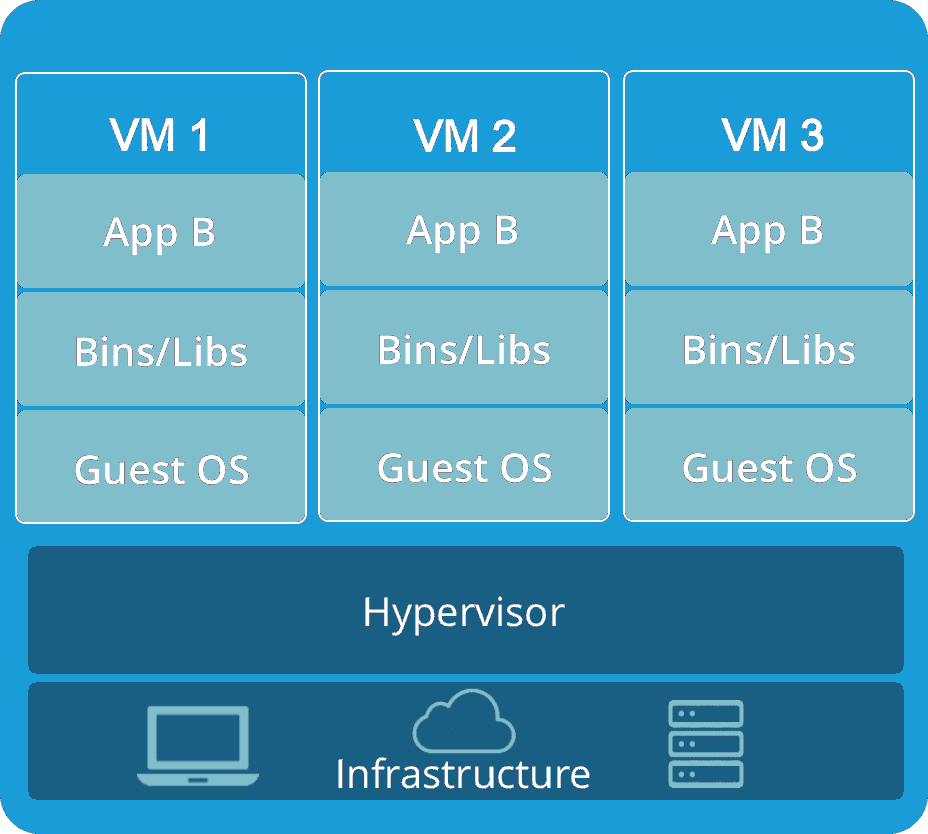
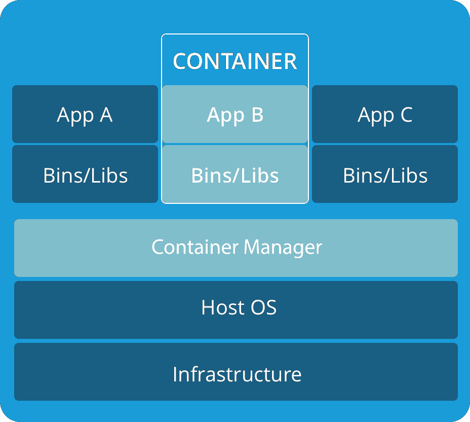

Khái niệm PaaS,On-Premise,IaaS,SaaS
**Kiến thức cơ bản**
+ Container
    *Container là gì?. Quá trình phát triển ra sao*
    - Thời đại triển khai theo cách truyền thống: Ban đầu, các ứng dụng được chạy trên các máy chủ vật lý. Không có cách nào để xác định ranh giới tài nguyên cho các ứng dụng trong máy chủ vật lý và điều này gây ra sự cố phân bổ tài nguyên. Ví dụ, nếu nhiều ứng dụng cùng chạy trên một máy chủ vật lý, có thể có những trường hợp một ứng dụng sẽ chiếm phần lớn tài nguyên hơn và kết quả là các ứng dụng khác sẽ hoạt động kém đi. Một giải pháp cho điều này sẽ là chạy từng ứng dụng trên một máy chủ vật lý khác nhau. Nhưng giải pháp này không tối ưu vì tài nguyên không được sử dụng đúng mức và rất tốn kém cho các tổ chức để có thể duy trì nhiều máy chủ vật lý như vậy.

    - Thời đại triển khai ảo hóa: Như một giải pháp, ảo hóa đã được giới thiệu. Nó cho phép bạn chạy nhiều Máy ảo (VM) trên CPU của một máy chủ vật lý. Ảo hóa cho phép các ứng dụng được cô lập giữa các VM và cung cấp mức độ bảo mật vì thông tin của một ứng dụng không thể được truy cập tự do bởi một ứng dụng khác.

        Ảo hóa cho phép sử dụng tốt hơn các tài nguyên trong một máy chủ vật lý và cho phép khả năng mở rộng tốt hơn vì một ứng dụng có thể được thêm hoặc cập nhật dễ dàng, giảm chi phí phần cứng và hơn thế nữa. Với ảo hóa, bạn có thể có một tập hợp các tài nguyên vật lý dưới dạng một cụm các máy ảo sẵn dùng.

        Mỗi VM là một máy tính chạy tất cả các thành phần, bao gồm cả hệ điều hành riêng của nó, bên trên phần cứng được ảo hóa.

    - Thời đại triển khai Container: Các container tương tự như VM, nhưng chúng có tính cô lập để chia sẻ Hệ điều hành (HĐH) giữa các ứng dụng. Do đó, container được coi là nhẹ (lightweight). Tương tự như VM, một container có hệ thống tệp (filesystem), CPU, bộ nhớ, process space, v.v. Khi chúng được tách rời khỏi cơ sở hạ tầng bên dưới, chúng có thể khả chuyển (portable) trên cloud hoặc các bản phân phối Hệ điều hành.Các container đã trở nên phổ biến vì chúng có thêm nhiều lợi ích, chẳng hạn như:
        - Tạo mới và triển khai ứng dụng Agile: gia tăng tính dễ dàng và hiệu quả của việc tạo các container image so với việc sử dụng VM image.
        - Phát triển, tích hợp và triển khai liên tục: cung cấp khả năng build và triển khai container image thường xuyên và đáng tin cậy với việc rollbacks dễ dàng, nhanh chóng.
        - Phân biệt giữa Dev và Ops: tạo các images của các application container tại thời điểm build/release thay vì thời gian triển khai, do đó phân tách các ứng dụng khỏi hạ tầng.
        Khả năng quan sát không chỉ hiển thị thông tin và các metric ở mức Hệ điều hành, mà còn cả application health và các tín hiệu khác.
        - Tính nhất quán về môi trường trong suốt quá trình phát triển, testing và trong production: Chạy tương tự trên laptop như trên cloud.
        - Tính khả chuyển trên cloud và các bản phân phối HĐH: Chạy trên Ubuntu, RHEL, CoreOS, on-premises, Google Kubernetes Engine và bất kì nơi nào khác.
        - Quản lý tập trung ứng dụng: Tăng mức độ trừu tượng từ việc chạy một Hệ điều hành trên phần cứng ảo hóa sang chạy một ứng dụng trên một HĐH bằng logical resources.
        - Các micro-services phân tán, elastic: ứng dụng được phân tách thành các phần nhỏ hơn, độc lập và thể được triển khai và quản lý một cách linh hoạt - chứ không phải một app nguyên khối (monolithic).
        - Cô lập các tài nguyên: dự đoán hiệu năng ứng dụng
        Sử dụng tài nguyên: hiệu quả
+ Giờ ta thử đi so sánh giữa ảo hóa(VM) và container hóa. Và vì sao container hóa càng ngày càng phổ biến:
    - **Ảo hoá Virtual Machine**:
        chúng ta có thể hình dung được ngay đó chính là cách sử dụng ảo hoá thông thường mà người dùng hay lựa chọn như: VMWare, Virtual Box, Parallel,...  Việc triển khai các VM riêng lẻ được hỗ trợ bằng cách sử dụng hypervisor(Hyper-V)

        Đây chính là giải pháp rất tốt khi chúng ta muốn chạy nhiều hệ điều hành cùng một lúc trên một máy. Với giải pháp ảo này, toàn bộ hệ thống từ Phần cứng (RAM, CPU, HDD,...) cho đến Hệ điều hành đều được "ảo hoá". Đem lại trải nghiệm sử dụng gần tương đương như một máy thật.

        chúng ta không cần quan tâm nhiều đến hệ điều hành của máy chính (host system: máy được dùng để cài máy ảo) là hệ điều hành nào. Chỉ cần có nhu cầu cài hệ điều hành bất kỳ mà "Máy Ảo" hỗ trợ là đều có thể cài được.

        Nhược điểm:Việc phải ảo hoá từ phần cứng đến nguyên cả một hệ điều hành làm tiêu tốn một khoản tài nguyên không hề nhỏ của hệ điều hành chủ (host system).Điểm yếu nữa của Virtual Machine thông thường đó là thời gian khởi chạy. Chúng ta phải khởi động cả hệ điều hành ảo mới chạy được dịch vụ. Và do đó thời gian startup, stop, hay restart nhanh cũng phải vài phút.
        
    - **Ảo hóa Container**:
        Ảo hoá Container còn có cách gọi khác là "ảo hoá mức hệ điều hành" (operating system virtualization). Chúng ta có thể thấy ngay sự khác nhau từ cái tên: một bên là "ảo hoá hệ điều hành" còn một bên là "máy ảo".

        chúng ta không ảo hoá cả phần cứng , hệ điều hành "như thật" nữa mà chỉ ảo hoá môi trường. Các dịch vụ trong Container vẫn chạy chung hệ điều hành chủ ở phía dưới, chung Kernel nhưng môi trường chạy của các dịch vụ thì luôn được đảm bảo hoàn toàn độc lập với nhau.

        Thuật ngữ "Container" ở đây được hiểu là khái niệm đóng gói. Một Container chứa đầy đủ application và tất các các thành phần phụ thuộc như: Các file Bins, các thư viện kèm theo để đảm bảo các ứng dụng có thể chạy độc lập trong container đó. Như vậy mỗi Container ở đây được coi như một "máy ảo" mini.

        Điểm mạnh lớn nhất của Container đó chính là "hiệu năng": Là ảo hoá nhưng Container lại rất nhẹ. Hệ điều hành chủ quản lý các Container bằng Systemd hoặc Upstart. Do vậy, các Container ở đây như là môt process của hệ thống. Chỉ mất vài giây để start, stop hay restart một Container và khi các container ở trạng thái Idle (chờ) chúng gần như không tiêu tốn tài nguyên CPU. Với một máy tính cấu hình thông thường, nếu chạy máy ảo virtual machine truyền thống, chúng ta chỉ chạy được khoảng vài cái. Tuy nhiên nếu chạy bằng Container chúng ta có thể chạy vài chục thậm chí đến cả vài trăm cái.
 
        Một điểm mạnh nữa của Container đó là tính di động và tính mở rộng: Chúng ta có thể tự tạo một Container từ các bản mẫu có sẵn, cài đặt môi trường, dịch vụ, sau đó lưu trạng thái Container lại như là một "image" và triển khai image này đến bất kỳ chỗ nào chúng ta mong muốn.
        Điểm yếu có thể coi là duy nhất của "ảo hoá sử dụng Container" đó chính là giới hạn của việc ảo hoá hệ điều hành: Do các Container sử dụng chung kernel với hệ điều hành của server (Host OS là hệ điều hành được cài đặt trên server) nên chúng ta chỉ có thể "ảo hoá" được các hệ điều hành mà hệ điều hành chủ hỗ trợ. Ví dụ:  
        
            Nếu hệ điều hành chủ là Linux thì chúng ta chỉ có thể ảo hoá được các hệ điều hành nhân Linux như Lubuntu, OpenSuse, LinuxMint,... chứ không thể tạo được một container Window được.

            Hoạt động trên cùng một phiên bản HĐH trên máy chủ. Quá trình container hóa phụ thuộc vào Host OS, vì vậy các LCX không thể chạy trên Windows và ngược lại.
    